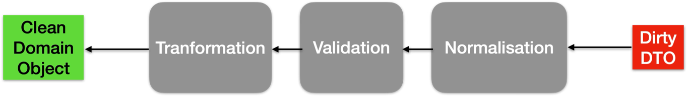

# Services-tiers : ces amis qui vous veulent du bien (jusqu’à ce qu’ils vous plantent)
Quand on cause avec des services tiers, tout se passe bien... jusqu’au jour où un petit truc cloche. Une donnée un peu bizarre, un format inattendu, une relique du web 1.0… et bam, votre application se prend les pieds dans le tapis.

Des exemples ? En voilà :
* Un numéro de téléphone qui commence par +33 (0) — et là, votre parseur panique.
* Un champ "opérateur télécom", soi-disant l’un des (orange, sfr, bouygues, free)  avec une valeur oubliée par l’Histoire : ft, neuf… on pensait ces entités disparues, mais elles survivent, tapies dans l’ombre des bases de données.
* Des caractères dans des champs âge, monnaie, numéro de rue, l’expérience nous dit que la liste est interminable
Alors on fait quoi ? On pleure ? On prie ? Non. On valide fort, on parse pour construire des objets métier et on teste large.

💡 La combo gagnante :
  ✔️ Des normalisations et des validations strictes à l’entrée, parce que si c’est (trop) pourri, c’est non.
  ✔️ Des tests sur des montagnes de données, rendu possible grˆ, pour découvrir tous les cas, disons divergents, avant que la prod ne les découvre pour vous.

Et pour aller encore plus loin, découvrez l’adapter contract testing, une technique que Mathieu Cans et moi partageons avec vous cette année à Devoxx et à AlpesCraft. Une façon élégante de dire à vos web-services : "Tu veux bien parler avec moi ? Très bien, mais voici le contrat. Et je le vérifie."

Bref, testez comme si votre tranquillité en astreinte en dépendait. Parce que… c’est le cas 😅

####  Voir aussi :
- [Adapter Contract Testing](README.md)
- [Refactoring du domaine](avantage-refactoring-du-domaine.md)
- [Migration des dépendances](avantage-migration-des-partenaires.md)