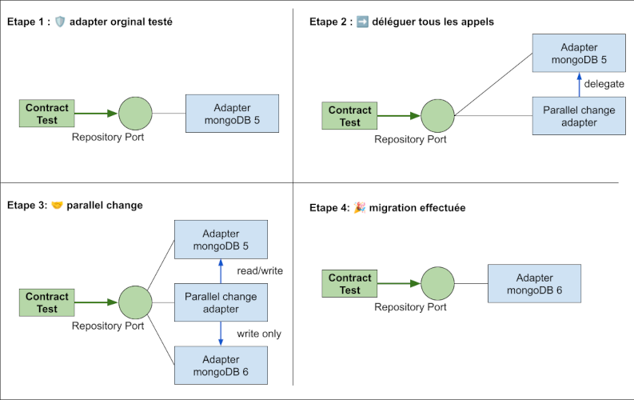

Migrer sans stress : ne tombez plus en panne au milieu de l’océan
===

Les migrations de stack technique, de version ou de modèle de base de données, sont source de stress.
Plusieurs problématiques pointent à l’horizon :
- Est-ce que tout fonctionne comme avant ?
- Y aura-t-il des effets de bord inattendus dans mon application ?
- Ai-je bien porté tous les comportements sur la nouvelle version ?

Alors, est-ce qu’on aborde le sujet avec son porte bonheur préféré ou on se dote d’un solide filet de sécurité ?

Avec Johan Martinsson, nous utilisons depuis plusieurs années la technique de l’[Adapter Contract Testing](README.md), qui nous permet de migrer nos dépendances avec une grande sérénité ☯️.
En s’appuyant sur l’architecture hexagonale, cette méthode offre des avantages significatifs :

- 🎣 **Capture des comportements essentiels** : Seuls les comportements nécessaires à notre application sont isolés derrière le pattern port/adapter. Cela garantit que nous ne dépendons et ne testons que le strict minimum.
- 🛟 **Testabilité décuplée** : En quelques lignes seulement, il est possible de vérifier que le nouveau partenaire respecte les attentes. Ce filet de sécurité fiable permet de visualiser clairement ce qu’il reste à faire.
- 👣 **Migration progressive** : Grâce à l’inversion de dépendance et aux changements en parallèle, il devient possible de migrer étape par étape, sans précipitation plutôt que de se jeter à l’eau d’un seul coup.

**Exemple : migration de base de données pas à pas :**

Pour migrer une base de données progressivement, il devient possible d’écrire un adaptateur qui écrit dans les deux bases tout en ne lisant que dans une seule.
Cette approche permet de transférer les données petit à petit et de basculer une fois la migration terminée.

Cette méthode offre une transition maîtrisée, en minimisant les risques et en renforçant la confiance dans les 
changements de partenaires.

####  Voir aussi :
- [Adapter Contract Testing](README.md)
- [Refactoring du domaine](avantage-refactoring-du-domaine.md)
- [Intégration sans surprise](avantage-integration-services-tiers-sans-surprises.md)