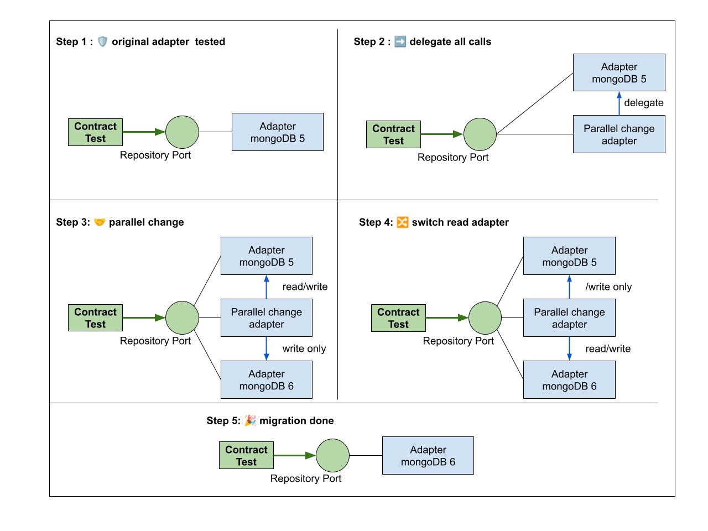

Migrer sans stress : ne tombez plus en panne au milieu de l’océan
===

Les migrations de stack technique, de version ou de modèle de base de données, sont source de stress. 
Plusieurs problématiques pointent à l’horizon :
 - Est-ce que tout fonctionne comme avant ?
 - Est-ce qu’il va y avoir des effets de bord inattendus dans mon application ?
 - Est-ce que j’ai bien porté tout ce qu’il fallait sur la nouvelle version ?

Alors, est-ce qu’on aborde le sujet avec son porte bonheur préféré ou on se dote d’un solide filet de sécurité ?

Avec Johan Martinsson nous pratiquons depuis plusieurs années la technique de l’[Adapter Contract Testing](README.md) qui nous permet de migrer nos dépendances avec beaucoup de sérénité.
En tirant profit de l’architecture hexagonale cette technique apporte les bénéfices suivant :
 - **capture des comportements** : seuls les comportements nécessaires à notre application sont isolés derrière le pattern port/adapter. On ne dépend et ne teste que du strict minimum
 - **testabilité décuplée** : en quelques lignes seulement il est possible de vérifier que le nouveau partenaire est conforme aux attendus.
 - **migration progressive possible** : grâce à l’inversion de dépendance et les changements en parallèle, il devient possible de migrer les choses petit à petit plutôt que de se jeter à l’eau d’un seul coup

Par exemple : pour changer de base de donnée petit à petit, il devient possible d'écrire un adaptateur qui écrit dans les deux bases et ne lit que dans une seule. Celà permet de migrer petit à petit toutes les données pour basculer une fois que tout est fini

Cette approche permet d'aborder les migrations avec sérénité, en minimisant les risques et en garantissant une transition maîtrisée.