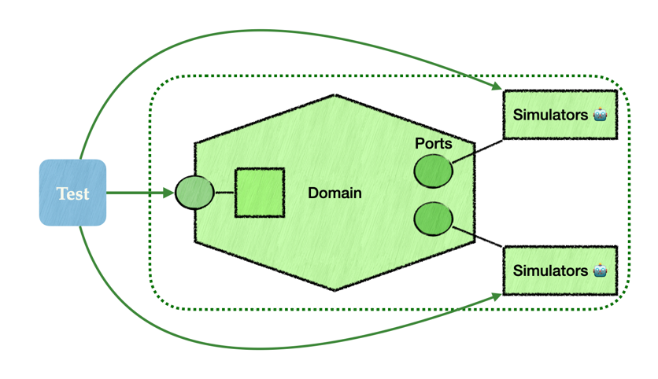

# Refactorer sans crainte grâce aux tests gros grain
Rien de plus frustrant qu’un refactoring bien intentionné… qui casse une dizaine de tests unitaires 🤯.
On voulait juste simplifier une classe, mais on se retrouve à devoir ajuster des mocks, 
des assertions ou des doubles de test qui n’ont plus de sens. C’est épuisant, et pire : 
ça donne l’impression que les tests sont un frein au changement 🛑. Mais les tests ne devraient jamais freiner un refactoring. Leur rôle, c’est de garantir 
que le comportement métier reste inchangé — pas de valider une implémentation.

Une piste solide pour sortir de ce piège : écrire des tests gros grain, qui valident 
l’application à travers ses interfaces naturelles. Dans une architecture hexagonale, 
cela veut dire : tester à travers les interfaces métier du domaine (ports d’entrée), tout en simulant 🎭 parfaitement les dépendances externes (les ports de sortie).

Et qu’est-ce qui nous permet d’avoir ces simulateurs "parfaits" ? C’est là qu’intervient 
<a href="./">l’adapter contract testing</a> : en définissant clairement les contrats entre l’hexagone et ses adaptateurs, 
on peut simuler leur comportement avec précision, sans dériver du réel. On garde ainsi des tests fiables, 
robustes, et représentatifs de ce qui se passe en production.

👉Résultat ? On peut refactorer l’intérieur de l’hexagone sans crainte. Tant que les règles métier sont 
respectées et que les ports restent cohérents, les tests restent verts. Et surtout : utiles.
Ce genre de tests donne confiance. Ils encouragent les refactorings profonds. Et ils nous rappellent 
que les tests sont là pour sécuriser 🛟 le code… pas pour l’enfermer 🔒.

####  Voir aussi :
- [Adapter Contract Testing](README.md)
- [Migration des dépendances](avantage-migration-des-partenaires.md)