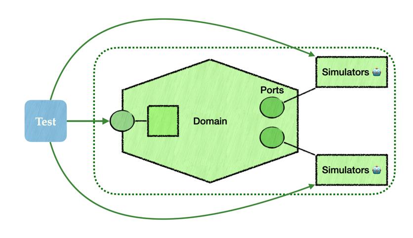

# Fearless Refactoring with Coarse-Grained Tests
Nothing is more frustrating than a well-intentioned refactoring... that breaks a dozen unit tests 🤯.  
You just wanted to simplify a class, but now you have to adjust mocks, 
assertions, or test doubles that no longer make sense. It's exhausting, and worse: 
it gives the impression that tests are a barrier to change 🛑. But tests should never hinder refactoring.
Their role is to ensure that business behavior remains unchanged — not to validate an implementation.

A solid way out of this trap: write coarse-grained tests that validate the application through its natural interfaces.
In a hexagonal architecture, this means: 
testing through the domain's business interfaces (entry ports) while **perfectly simulating 🎭** external dependencies (output ports).

And what allows us to have these "perfect" simulators? This is where  
<a href="./">adapter contract testing</a> comes into play: by clearly defining the contracts between the hexagon 
and its adapters, we can simulate their behavior with precision, without drifting from reality.
This keeps tests reliable, robust, and representative of what happens in production.

👉 **Result?** You can refactor the inside of the hexagon without fear. As long as business rules are respected
and the ports remain consistent, the tests are still green. And most importantly: useful.  
This kind of testing builds confidence. It encourages deep refactorings. And it reminds us that tests are there
to secure 🛟 the code... not to lock it down 🔒.

#### See also:
- [Adapter Contract Testing](README.md)
- [Dependency Migration](avantage-migration-des-partenaires.md)
- [Integration Without Surprises](avantage-integration-services-tiers-sans-surprises.md)